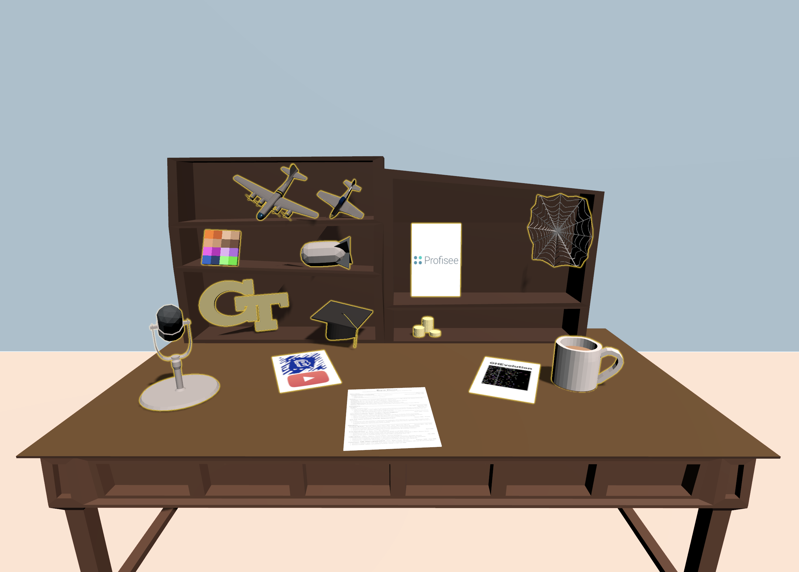
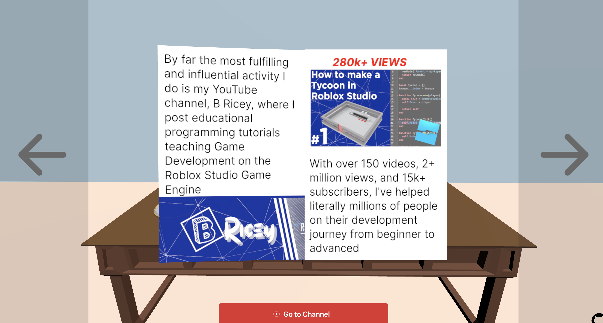
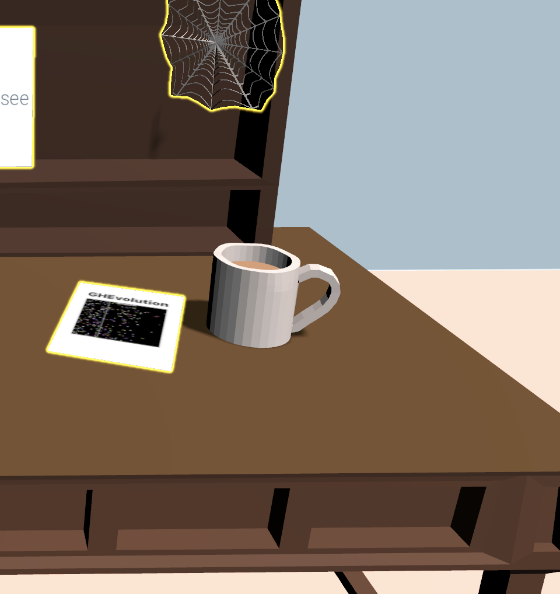
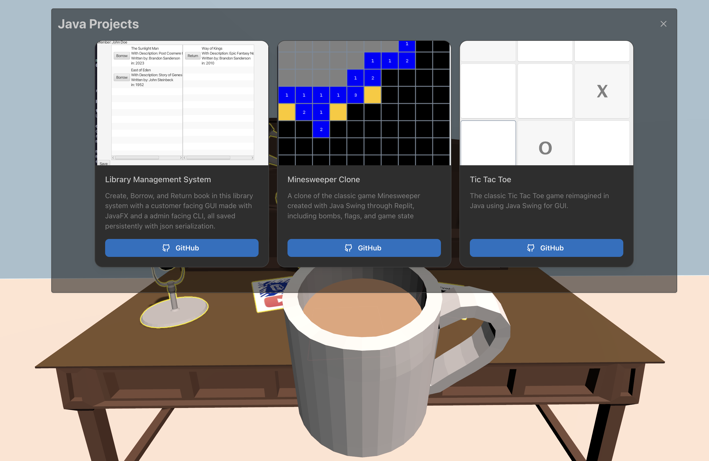
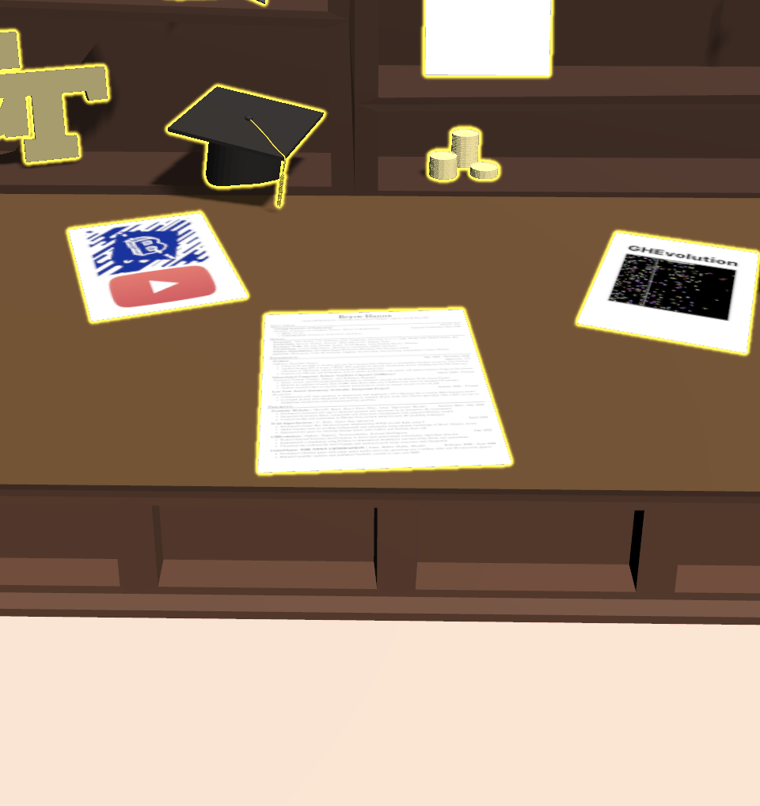
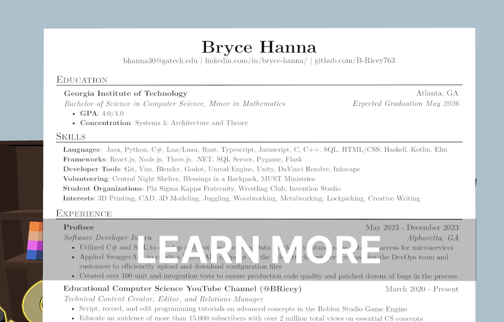

# My Portfolio

## Wait, it's 3D?!?
Why did I spend the time (a long time, mind you) to make a fully 3D portfolio website when I could've just slapped together a static site, used some CSS to make it pretty, and called it a day?

I started programming with 3D Roblox video games (in fact, I make YouTube videos on how to make said games on [my youtube channel](https://www.youtube.com/@BRicey)), so I'm pretty good at making 3D experiences with reactive state; in addition, I love creating 3D models in Blender as a fun hobby outside of programming. 

Combine aformentioned skills/interests, complete incompetence in UX/UI design, and an obsession with spending 100 hours to make something that should take 50 minutes, and you get my portfolio website at [brycehanna.dev](brycehanna.dev). 

At it's initial release in May of 2024, this project was the most challenging piece of software I've ever written, requiring expertise in **3D graphics, ThreeJS, Blender, Vertex Animation, UV Mapping & Textures, Shaders, Typescript, React, Mantine (a component library), React Three Fiber, State Management (I used [jotai](https://jotai.org/)),** and Meshing everything together in one great symphony (or cacophony, depending on your outlook) of a web dev project if you can even call it that. 

This project was the gauntlet of my development career, testing not only sheer programming prowess but artistic sensibility, documentation dedication, and google greatness. 

## Features

### Books (well, pamphlets)

Clicking on one of the couple magazine/pamphlet things on the desk will open up a fully animated magazine model. These animations alone took me a couple months to get right, as exported `.glb` files don't support animated blender modifiers, so I had to go through the convoluted process of exporting a `.mdd` animation file and applying it to the model to have the animation baked into the verticies. 

Each page was created in Inkscape and is rendered as a png texture on the model. Under the hood, each page of the base book model has a different material in blender and I'm using that as a reference when I assign the textures at runtime. 

The arrows at the side allow you to navigate back and forth between the pages. 

> Fun Fact: my original plan for this project was a single book that flipped to each project in my lineup, but it only turned out being a somewhat minor feature. Amazing how development works out!

### Standard Items

Each object on the desk is interactable as indicated by the pusling yellow outline. When you hover over an object you can pick up, your cursor will change to the grab icon and the item will be outlined in white, and clicking on it will bring it up to focus and show you what project(s) it represents. 

Here, you can see the coffee cup represents my *Java* projects (ha, get it?). To put down the item, click anywhere not in the GUI or the 'X' in the top right. 

### Resume

When picking up my [resume](https://b-ricey763.github.io/resume/hanna-bryce-resume.pdf), you'll notice you not only get the standard animation but also some hovering "Learn More" buttons on each resume item. 

Click that, and it'll automatically bring you to it's respective item. Using this, you can navigate my portfolio projects with some semblance of hierarchy because not all projects are created equal. It acts as a sort of map between my biggest projects. 

## Running Locally

Clone the repository, and open up the directory in your shell. Run `npm install` to get dependencies and run `npm run dev` to start the local development server. 

## How it works
I'll flesh this out eventually, but basically:

- [React Three Fiber](https://docs.pmnd.rs/react-three-fiber/getting-started/introduction) handles the 3d stuff, combining React with ThreeJS
- I used [gltf to jsx](https://gltf.pmnd.rs/) to convert my models into `.tsx` files for easier use (most notable example is `src/Desk.tsx`)
- [Jotai](https://jotai.org/) atoms made state management easy
- For the actual UI, I used [Mantine](https://mantine.dev/) as my component library, so the top level `Canvas` R3F component has a sibling, `OverlayManager` which is a `MantineProvider` wrapper. Every time you pick up an item, defined in `src/Items.tsx`, it swaps the UI being displayed. 
- If your wondering about the books, I had to hack so much together to make it work. I'm hoping I'll be able to make it cleaner in the future, but for now, for your own good, don't look at `src/ThickMagazine.tsx`

Oh, and the site should work on mobile too. Yeah, I got that *responsive* design :wink:
